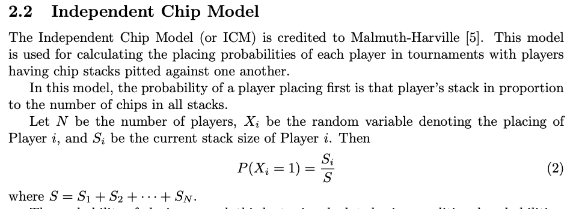
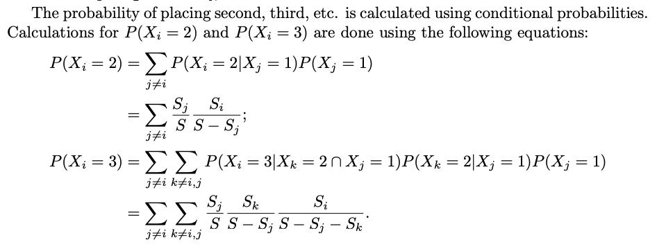
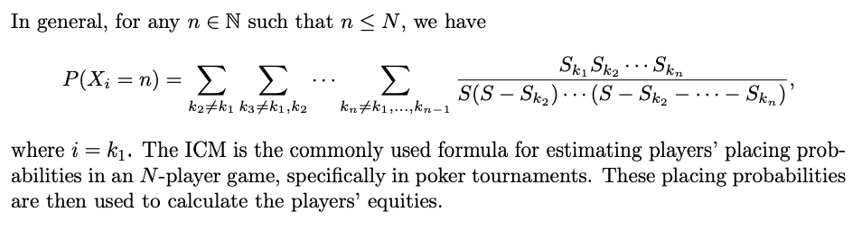

# Independent Chip Model (ICM) Calculator

For those of you that need an Independent Chip Model (ICM) implementation (mine is written in Java) look no further. The code is documented with comments that I hope will explain how it works.

Read on to learn more...

Sometimes the players in a poker tournament will chop the pot instead of playing to end where one player takes first place. This repository is an implementation of the ICM algorithm to determine how to chop a pot.

I am not going to explain how ICM works - do a Google search and you will get lots of hits.

I found an article from the Journal of the Mathematical Society of the Philippines which has an equation for the Malmuth-Harville equation in section 2.2 that I used for my algorithm. See <a href="http://mathsociety.ph/matimyas/images/vol43/MarfilMatimyas.pdf">http://mathsociety.ph/matimyas/images/vol43/MarfilMatimyas.pdf</a>.

Here is section 2.2 from that document.

